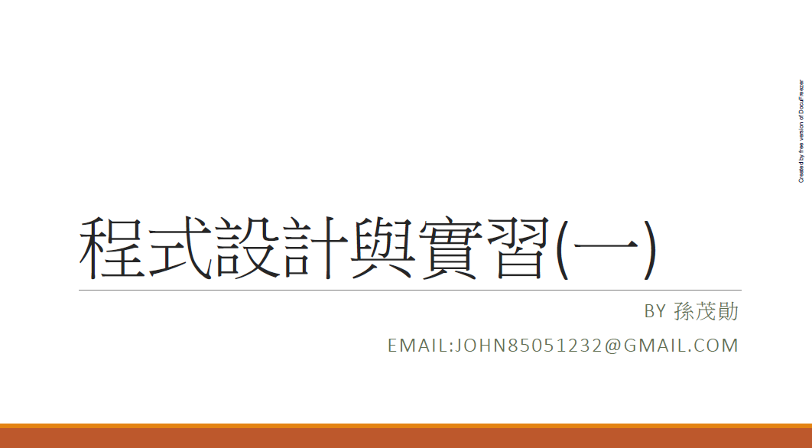
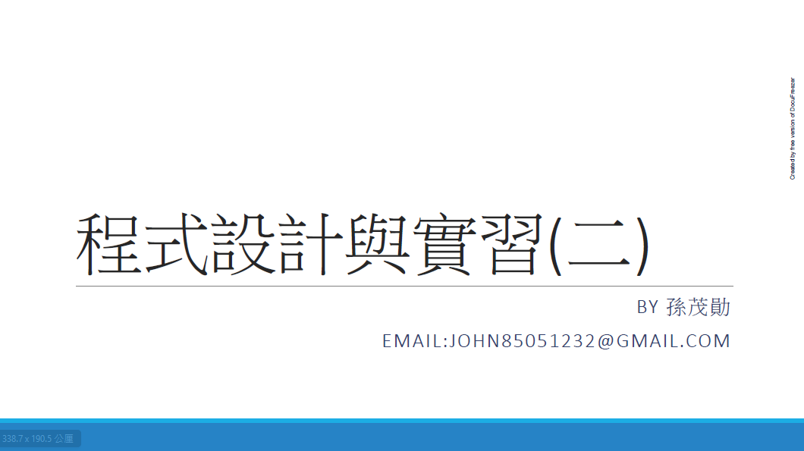
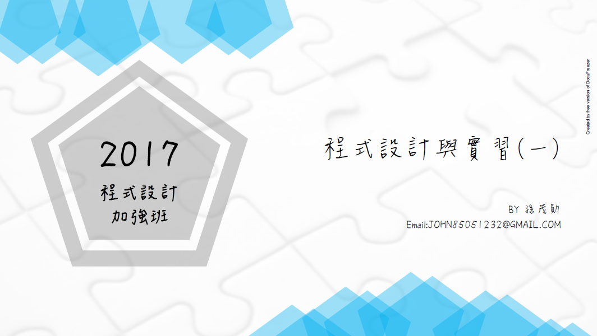
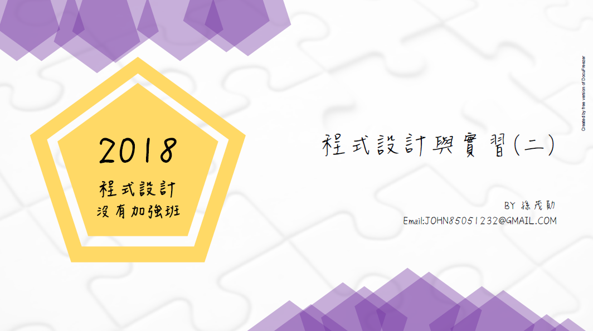

# 高大資工程式加強班講義(109~110級)

高大資工大一的程式設計課程，每週一次，會由助教利用晚上大約兩小時的時間來開設程式加強班課程，加強修課同學對於程式設計的實作能力。

# 講義製作
這是我擔任程式設計助教時所製作的講義，程式設計課分為兩學期，上學期主要在介紹C語言的各項基本概念，下學期則是注重資料結構和撰寫程式題目能力的提升，並以通過高大資工程式設計畢業門檻為目標(CPE一次兩題 or 累積4題)。
## 資工109級

## 資工110級

## Detail
You can see my blog: [ [7/2]高大資工程式助教心路歷程 ](https://john850512.wordpress.com/2018/07/02/7-2%E9%AB%98%E5%A4%A7%E8%B3%87%E5%B7%A5%E7%A8%8B%E5%BC%8F%E5%8A%A9%E6%95%99%E5%BF%83%E8%B7%AF%E6%AD%B7%E7%A8%8B/#more-2382) 
